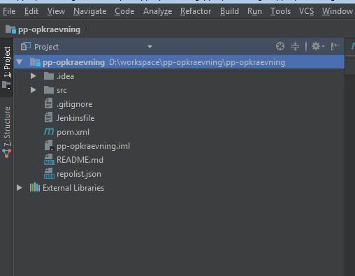

## Setting up a Java backend project
##### Create a new git repository 
In this example I will create a repository called **pp-opkraevning** remember to create with a README.md
##### Clone project to IDE
git clone _**git@github.topdanmark.local:pp-opkraevning/pp-opkraevning.git**_
and create a new branch **develop**
##### Create the following project structure

add the following files:
##### .gitignore
* [.gitignore documentation](https://help.github.com/articles/ignoring-files/)
* example: pp-opkraevning .gitignore
           
           ### No class files
           .class
           
           ### IntelliJ
           *.iml
           .idea/
                  
           ### Maven
           target/
           
           ### Package Files
           *.jar
           *.war
           *.ear
           
           ### JRebel
           rebel.xml
                      
           /developer_local/

##### Jenkinsfile
* [Jenkinsfile documentation](https://jenkins.io/doc/book/pipeline/jenkinsfile/)
* example: pp-opkraevning Jenkinsfile 

               node('ecs4') {

               def branch = "${env.BRANCH_NAME}"
               println "Branch: $branch"
           
               stage 'print versions'
                 sh """
                     node --version
                     npm --version
                     git --version
                     mvn --version
                     java -version
                 """
           
               stage 'clone from git'
                   git changelog: false, poll: false, url: 'git@github.topdanmark.local:pp-opkraevning/pp-opkraevning.git', branch: branch
           
               stage 'create war file'
                   switch (branch) {
                       case "develop":
                           sh 'mvn package'
                           break
                       case "master":
                           println "This step is ignored by the master branch"
                           break
                       case "preproduction":
                           println "Building artifact for preproduction"
                           topRemoveSnapshotOnPreproduction()
                           sh 'mvn package'
                           break
                       default:
                           sh 'mvn package'
                           break
                   }
           
               stage 'publish to artifactory'
                   switch (branch) {
                       case "develop":
                           topCompliance()
                           break
                       case "master":
                           sh """
                               git checkout -b preproduction master
                               git push origin preproduction
                           """
                           break
                       case "preproduction":
                           topCompliance()
                           sh """
                               git push origin :preproduction
                           """
                           break
                       default:
                           println "Branch $branch not found in Jenkinsfile, Default configuration is used"
                           topCompliance()
                           break
                   }
           
               stage 'deploy'
                   switch (branch) {
                       case "develop":
                           sh 'mvn was:deploy -Denvironment=dscm118 -DblName=pp-opkraevning'
                           break
                       case "master":
                           println "Deployment is skipped on the master branch, deployment is done by gatekeeper"
                           break
                       case "preproduction":
                           print "Deploy to integration and release environments"
                           sh 'mvn was:deploy -Denvironment=integration -DblName=pp-opkraevning'
                           sh 'mvn was:deploy -Denvironment=release -DblName=pp-opkraevning'
                           break
                       default:
                           println "Branch $branch not found in Jenkinsfile, Default configuration is used"
                           sh 'mvn was:deploy -Denvironment=dscm119 -DblName=pp-opkraevning'
                           break
                   }
           
               stage 'test rest endpoints'
                   def jobName = 'pp-opkraevning-st/' + branch
                   switch (branch) {
                       case "develop":
                           println "DISABLED UNTIL JENKINS CAN CALL DSCM ENVIRONMENT"
                           //build job: jobName, parameters: [[$class:'StringParameterValue', name:'dscm', value:'dscm119']]
                           break
                       case "master":
                           println "Integration tests of endpoints are not scheduled on the master branch"
                           break
                       case "preproduction":
                           println "Integration tests of endpoints are not scheduled on the preproduction branch"
                           break
                       default:
                           println "DISABLED UNTIL JENKINS CAN CALL DSCM ENVIRONMENT"
                           //println "Branch $branch not found in Jenkinsfile, Default configuration is used"
                           //build job: jobName, parameters: [[$class:'StringParameterValue', name:'dscm', value:'dscm119']]
                           break
                   }
           }

##### README.md
* [README.md template](https://gist.github.com/jxson/1784669)

##### repolist.json
* reprolist.json - pp-opkraevning example
[
{
     "url" : "https://github.topdanmark.local/pp-opkraevning/pp-opkraevning.git"
   },
   {
      "url" : "https://github.topdanmark.local/pp-opkraevning/pp-opkraevning-st.git"
   },
   {
      "url" : "https://github.topdanmark.local/pp-opkraevning/pp-opkraevning-front.git"
   }
]

##### pom.xml
* pom.xml - pp-opkraevning example:
<?xml version="1.0" encoding="UTF-8"?>
    <project xmlns="http://maven.apache.org/POM/4.0.0"
     xmlns:xsi="http://www.w3.org/2001/XMLSchema-instance"
     xsi:schemaLocation="http://maven.apache.org/POM/4.0.0 http://maven.apache.org/xsd/maven-4.0.0.xsd">
    <modelVersion>4.0.0</modelVersion>
    <groupId>dk.topdanmark.pp</groupId>
    <artifactId>pp-opkraevning</artifactId>
    <version>1.0.0-SNAPSHOT</version>
    <packaging>war</packaging>
    <properties>
        <project.build.sourceEncoding>UTF-8</project.build.sourceEncoding>
        <maven.compiler.source>1.8</maven.compiler.source>
        <maven.compiler.target>1.8</maven.compiler.target>
        <junit.jupiter.version>5.0.0-M2</junit.jupiter.version>
        <junit.vintage.version>4.12.0-M2</junit.vintage.version>
        <junit.platform.version>1.0.0-M2</junit.platform.version>
        <failOnMissingWebXml>false</failOnMissingWebXml>
        <timestamp>${maven.build.timestamp}</timestamp>
        <sia.version>20161123</sia.version>
    </properties>
    <profiles>
        <profile>
            <id>development</id>
            <build>
                <finalName>pp-opkraevning</finalName>
            </build>
        </profile>
    </profiles>
    <build>
        <plugins>
            <plugin>
                <groupId>org.apache.maven.plugins</groupId>
                <artifactId>maven-compiler-plugin</artifactId>
                <version>3.5.1</version>
                <configuration>
                    <source>${maven.compiler.source}</source>
                    <target>${maven.compiler.target}</target>
                    <encoding>${project.build.sourceEncoding}</encoding>
                </configuration>
            </plugin>
            <plugin>
                <artifactId>maven-surefire-plugin</artifactId>
                <version>2.19</version>
                <dependencies>
                    <dependency>
                        <groupId>org.junit.platform</groupId>
                        <artifactId>junit-platform-surefire-provider</artifactId>
                        <version>${junit.platform.version}</version>
                    </dependency>
                </dependencies>
            </plugin>
            <plugin>
                <!-- Plugin documentatioon https://github.com/sdaschner/jaxrs-analyzer-maven-plugin/ -->
                <groupId>com.sebastian-daschner</groupId>
                <artifactId>jaxrs-analyzer-maven-plugin</artifactId>
                <version>0.10</version>
                <executions>
                    <execution>
                        <goals>
                            <goal>analyze-jaxrs</goal>
                        </goals>
                        <configuration>
                            <backend>swagger</backend>
                        </configuration>
                    </execution>
                </executions>
            </plugin>
            <plugin>
                <!-- Include swagger.json-->
                <artifactId>maven-resources-plugin</artifactId>
                <version>3.0.1</version>
                <executions>
                    <execution>
                        <id>copy-resources</id>
                        <phase>prepare-package</phase>
                        <goals>
                            <goal>copy-resources</goal>
                        </goals>
                        <configuration>
                            <outputDirectory>${project.build.directory}/${project.build.finalName}/jaxrs-analyzer</outputDirectory>
                            <resources>
                                <resource>
                                    <directory>${project.build.directory}/jaxrs-analyzer</directory>
                                </resource>
                            </resources>
                        </configuration>
                    </execution>
                </executions>
            </plugin>
        </plugins>
    </build>
    <dependencies>
        <!-- JEE PROVIDER -->
        <dependency>
            <groupId>javax</groupId>
            <artifactId>javaee-api</artifactId>
            <version>7.0</version>
            <scope>provided</scope>
        </dependency>
        <!-- TOPDANMARK -->
        <dependency>
            <groupId>dk.topdanmark.id</groupId>
            <artifactId>PortalProtect_Topdanmark_Agent</artifactId>
            <version>1.0</version>
            <exclusions>
                <exclusion>
                    <groupId>org.slf4j</groupId>
                    <artifactId>slf4j-api</artifactId>
                </exclusion>
                <exclusion>

                    <groupId>ch.qos.logback</groupId>
                    <artifactId>logback-classic</artifactId>
                </exclusion>
            </exclusions>
        </dependency>
        <dependency>
            <groupId>dk.topdanmark.ia</groupId>
            <artifactId>SIAServiceKontrakter</artifactId>
            <version>${sia.version}</version>
        </dependency>
        <dependency>
            <groupId>dk.topdanmark.cs</groupId>
            <artifactId>CSPing</artifactId>
            <version>20160201</version>
            <exclusions>
                <exclusion>
                    <artifactId>IDSikkerhedJEE</artifactId>
                    <groupId>dk.topdanmark.id</groupId>
                </exclusion>
            </exclusions>
        </dependency>
        <dependency>
            <groupId>dk.topdanmark.id</groupId>
            <artifactId>IDJaxWSHandler</artifactId>
            <version>1.0</version>
        </dependency>
        <dependency>
            <groupId>dk.topdanmark.id</groupId>
            <artifactId>IDSikkerhedJEE</artifactId>
            <version>1.0</version>
        </dependency>
        <!-- JUNIT 5 -->
        <dependency>
            <groupId>org.junit.jupiter</groupId>
            <artifactId>junit-jupiter-engine</artifactId>
            <version>${junit.jupiter.version}</version>
            <scope>test</scope>
        </dependency>
        <dependency>
            <groupId>org.junit.vintage</groupId>
            <artifactId>junit-vintage-engine</artifactId>
            <version>${junit.vintage.version}</version>
            <scope>test</scope>
        </dependency>
        <!-- MOCKITO -->
        <dependency>
            <groupId>org.mockito</groupId>
            <artifactId>mockito-all</artifactId>
            <version>1.9.5</version>
            <scope>test</scope>
        </dependency>
        <!-- JSON support under test -->
        <dependency>
            <groupId>org.glassfish</groupId>
            <artifactId>javax.json</artifactId>
            <version>1.0.4</version>
            <scope>test</scope>
        </dependency>
        <dependency>
            <groupId>org.glassfish.jersey.core</groupId>
            <artifactId>jersey-common</artifactId>
            <version>2.4.1</version>
            <scope>test</scope>
        </dependency>
        <!-- LOGGING -->
        <dependency>
            <groupId>org.slf4j</groupId>
            <artifactId>slf4j-api</artifactId>
            <version>1.7.5</version>
        </dependency>
        <dependency>
            <groupId>org.slf4j</groupId>
            <artifactId>jcl-over-slf4j</artifactId>
            <version>1.7.5</version>
            <exclusions>
                <exclusion>
                    <groupId>org.slf4j</groupId>
                    <artifactId>slf4j-api</artifactId>
                </exclusion>
            </exclusions>
        </dependency>
        <dependency>
            <groupId>ch.qos.logback</groupId>
            <artifactId>logback-classic</artifactId>
            <version>1.1.2</version>
            <exclusions>
                <exclusion>
                    <groupId>org.slf4j</groupId>
                    <artifactId>slf4j-api</artifactId>
                </exclusion>
                <exclusion>
                    <groupId>ch.qos.logback</groupId>
                    <artifactId>logback-core</artifactId>
                </exclusion>
            </exclusions>
        </dependency>
        <dependency>
            <groupId>ch.qos.logback</groupId>
            <artifactId>logback-core</artifactId>
            <version>1.1.2</version>
        </dependency>
        <!-- UTILITIES -->
        <dependency>
            <groupId>org.apache.commons</groupId>
            <artifactId>commons-lang3</artifactId>
            <version>3.1</version>
        </dependency>
    </dependencies>
</project>

#### Commit all changes to git 

